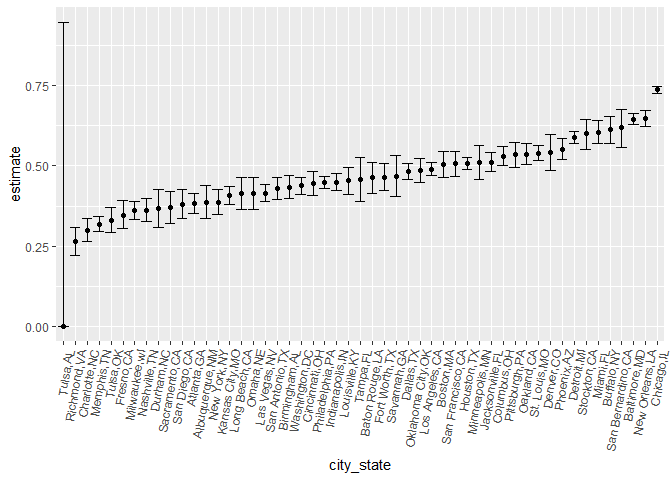
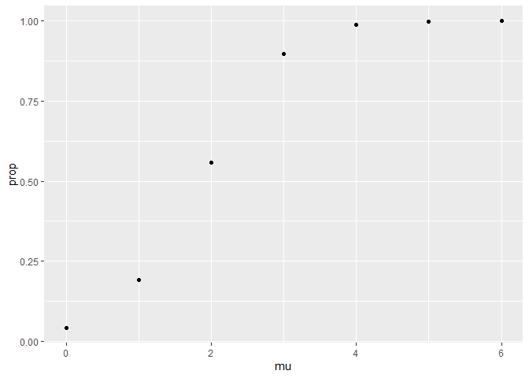
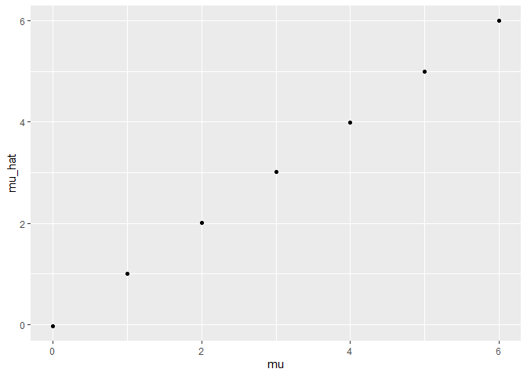

hw5
================
ht2611
2022-11-14

# 2

The data has 12 varaibles of 52179 observations. It records victim’s
name, race, sex, age and the place they were founded. The more detailed
description are showed below in the code.

``` r
library(tidyverse)
```

    ## ── Attaching packages ─────────────────────────────────────── tidyverse 1.3.2 ──
    ## ✔ ggplot2 3.3.6      ✔ purrr   0.3.4 
    ## ✔ tibble  3.1.8      ✔ dplyr   1.0.10
    ## ✔ tidyr   1.2.0      ✔ stringr 1.4.1 
    ## ✔ readr   2.1.2      ✔ forcats 0.5.2 
    ## ── Conflicts ────────────────────────────────────────── tidyverse_conflicts() ──
    ## ✖ dplyr::filter() masks stats::filter()
    ## ✖ dplyr::lag()    masks stats::lag()

``` r
library(purrr)
homicide=read_csv("./data/homicide-data.csv")
```

    ## Rows: 52179 Columns: 12
    ## ── Column specification ────────────────────────────────────────────────────────
    ## Delimiter: ","
    ## chr (9): uid, victim_last, victim_first, victim_race, victim_age, victim_sex...
    ## dbl (3): reported_date, lat, lon
    ## 
    ## ℹ Use `spec()` to retrieve the full column specification for this data.
    ## ℹ Specify the column types or set `show_col_types = FALSE` to quiet this message.

``` r
skimr::skim(homicide)
```

|                                                  |          |
|:-------------------------------------------------|:---------|
| Name                                             | homicide |
| Number of rows                                   | 52179    |
| Number of columns                                | 12       |
| \_\_\_\_\_\_\_\_\_\_\_\_\_\_\_\_\_\_\_\_\_\_\_   |          |
| Column type frequency:                           |          |
| character                                        | 9        |
| numeric                                          | 3        |
| \_\_\_\_\_\_\_\_\_\_\_\_\_\_\_\_\_\_\_\_\_\_\_\_ |          |
| Group variables                                  | None     |

Data summary

**Variable type: character**

| skim_variable | n_missing | complete_rate | min | max | empty | n_unique | whitespace |
|:--------------|----------:|--------------:|----:|----:|------:|---------:|-----------:|
| uid           |         0 |             1 |   9 |  10 |     0 |    52179 |          0 |
| victim_last   |         0 |             1 |   1 |  20 |     0 |    12687 |          0 |
| victim_first  |         0 |             1 |   1 |  28 |     0 |    16640 |          0 |
| victim_race   |         0 |             1 |   5 |   8 |     0 |        6 |          0 |
| victim_age    |         0 |             1 |   1 |   7 |     0 |      102 |          0 |
| victim_sex    |         0 |             1 |   4 |   7 |     0 |        3 |          0 |
| city          |         0 |             1 |   5 |  14 |     0 |       50 |          0 |
| state         |         0 |             1 |   2 |   2 |     0 |       28 |          0 |
| disposition   |         0 |             1 |  14 |  21 |     0 |        3 |          0 |

**Variable type: numeric**

| skim_variable | n_missing | complete_rate |        mean |         sd |          p0 |         p25 |         p50 |         p75 |          p100 | hist  |
|:--------------|----------:|--------------:|------------:|-----------:|------------:|------------:|------------:|------------:|--------------:|:------|
| reported_date |         0 |             1 | 20130899.16 | 1123419.63 | 20070101.00 | 20100318.00 | 20121216.00 | 20150911.00 | 201511105\.00 | ▇▁▁▁▁ |
| lat           |        60 |             1 |       37.03 |       4.35 |       25.73 |       33.77 |       38.52 |       40.03 |         45.05 | ▁▅▅▇▅ |
| lon           |        60 |             1 |      -91.47 |      13.75 |     -122.51 |      -96.00 |      -87.71 |      -81.76 |        -71.01 | ▃▁▃▇▅ |

``` r
homicide=homicide%>%
  mutate(city_state=str_c(city,",",state))

total_home=homicide%>%
  group_by(city_state)%>%
  summarise(total=n())

unsolved=homicide%>%
  filter(disposition!="Closed by arrest")%>%
  group_by(city_state)%>%
  summarise(unsolved=n())

request=full_join(total_home,unsolved)
```

    ## Joining, by = "city_state"

``` r
request
```

    ## # A tibble: 51 × 3
    ##    city_state     total unsolved
    ##    <chr>          <int>    <int>
    ##  1 Albuquerque,NM   378      146
    ##  2 Atlanta,GA       973      373
    ##  3 Baltimore,MD    2827     1825
    ##  4 Baton Rouge,LA   424      196
    ##  5 Birmingham,AL    800      347
    ##  6 Boston,MA        614      310
    ##  7 Buffalo,NY       521      319
    ##  8 Charlotte,NC     687      206
    ##  9 Chicago,IL      5535     4073
    ## 10 Cincinnati,OH    694      309
    ## # … with 41 more rows

``` r
pred_Balt=prop.test(1825,2827)
broom::tidy(pred_Balt) %>%
  select(estimate,conf.low,conf.high)
```

    ## # A tibble: 1 × 3
    ##   estimate conf.low conf.high
    ##      <dbl>    <dbl>     <dbl>
    ## 1    0.646    0.628     0.663

``` r
request_test=request%>%
  na.omit()%>%
  mutate(prop_test=map2(.x=unsolved,.y=total,~prop.test(x=.x,n=.y)))%>%
  mutate(prop_test=map(prop_test,broom::tidy))%>%
  unnest(prop_test)%>%
  select(city_state,estimate,conf.low,conf.high)
request_test
```

    ## # A tibble: 50 × 4
    ##    city_state     estimate conf.low conf.high
    ##    <chr>             <dbl>    <dbl>     <dbl>
    ##  1 Albuquerque,NM    0.386    0.337     0.438
    ##  2 Atlanta,GA        0.383    0.353     0.415
    ##  3 Baltimore,MD      0.646    0.628     0.663
    ##  4 Baton Rouge,LA    0.462    0.414     0.511
    ##  5 Birmingham,AL     0.434    0.399     0.469
    ##  6 Boston,MA         0.505    0.465     0.545
    ##  7 Buffalo,NY        0.612    0.569     0.654
    ##  8 Charlotte,NC      0.300    0.266     0.336
    ##  9 Chicago,IL        0.736    0.724     0.747
    ## 10 Cincinnati,OH     0.445    0.408     0.483
    ## # … with 40 more rows

``` r
request_test %>%
  mutate(city_state = fct_reorder(city_state,estimate)) %>%
  ggplot(aes(x = city_state, y = estimate)) +
  geom_point() +
  geom_errorbar(aes(ymin = conf.low, ymax = conf.high)) +
  theme(axis.text.x = element_text(angle = 80, hjust=1))
```

<!-- -->

# 3

# basic function for t.test of norm

``` r
norm_sim <- function(mu, n = 30, sd = 5) {
  sim_data=tibble(
    x <- rnorm(n,mean = mu, sd = sd))
  
  sim_data %>%
    t.test(mu = mu) %>%
    broom::tidy() %>%
    select(estimate,p.value)
}
```

``` r
sim_results_df = 
  expand_grid(
    mu=0:6,
    iter = 1:5000
  ) %>% 
  mutate(
    estimate_df = map(mu, norm_sim)
  ) %>% 
  unnest(estimate_df)
```

``` r
df1=sim_results_df%>%
  group_by(mu)%>%
  filter(p.value < 0.05) %>%
   summarise(prop = n()/5000)

df1 %>%
  ggplot(aes(x = mu,y = prop)) +
  geom_point() 
```

<!-- -->

The larger the size is, the larger the power is.

``` r
df2=sim_results_df%>%
  group_by(mu)%>%
  summarise(mu_hat=mean(estimate))

df2%>%
  ggplot(aes(x = mu,y = mu_hat)) +
  geom_point()
```

<!-- -->

``` r
df3=sim_results_df%>%
  group_by(mu)%>%
  filter(p.value < 0.05) %>%
   summarise(mu_hat=mean(estimate))

df3%>%
  ggplot(aes(x = mu,y = mu_hat)) +
  geom_point()
```

<!-- -->

No, they are not equal. Because when the null is rejected, in the 0.05
significant level, the generated u is not equal to true u.
